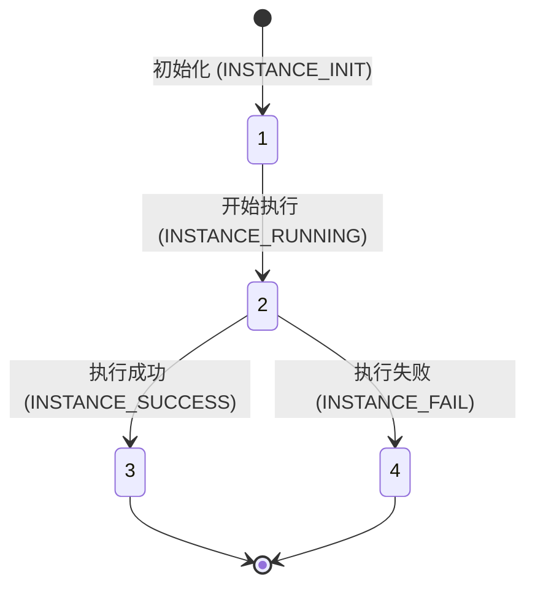

# 流程实例表

## 基础信息
| 属性 | 值 |
|------|-----|
| 数据库 | dataops |
| 表名 | dataops_process_instance_info |
| 完整表名 | dataops.dataops_process_instance_info |
| 数据源 | MySQL |

## 表结构

```sql
CREATE TABLE `dataops_process_instance_info` (
  `id` bigint(20) NOT NULL AUTO_INCREMENT COMMENT '流程实例ID',
  `process_id` bigint(20) DEFAULT NULL COMMENT '流程定义ID',
  `process_business_id` bigint(20) DEFAULT NULL COMMENT '流程的业务数据ID',
  `start_time` datetime DEFAULT NULL COMMENT '开始时间',
  `end_time` datetime DEFAULT NULL COMMENT '结束时间',
  `status` int(11) DEFAULT NULL COMMENT '状态：1-初始化，2-运行中，3-运行成功，4-运行失败',
  `version` int(11) DEFAULT NULL COMMENT '版本号',
  `created_by` varchar(100) DEFAULT NULL COMMENT '创建人姓名',
  `created_dept` varchar(100) DEFAULT NULL COMMENT '创建人部门',
  `updated_by` varchar(100) DEFAULT NULL COMMENT '更新人姓名',
  `updated_dept` varchar(100) DEFAULT NULL COMMENT '更新人部门',
  `created_uid` varchar(100) DEFAULT NULL COMMENT '创建人UID',
  `updated_uid` varchar(100) DEFAULT NULL COMMENT '更新人UID',
  `created_at` timestamp NOT NULL DEFAULT CURRENT_TIMESTAMP COMMENT '创建时间',
  `updated_at` timestamp NOT NULL DEFAULT CURRENT_TIMESTAMP ON UPDATE CURRENT_TIMESTAMP COMMENT '更新时间',
  `user_journey` varchar(255) DEFAULT NULL COMMENT '用户旅程节点',
  `write_table_type` varchar(50) DEFAULT NULL COMMENT '写表类型',
  `version_field_name` varchar(100) DEFAULT NULL COMMENT '版本字段名称',
  PRIMARY KEY (`id`),
  KEY `idx_process_id` (`process_id`),
  KEY `idx_process_business_id` (`process_business_id`),
  KEY `idx_status` (`status`),
  KEY `idx_created_at` (`created_at`)
) ENGINE=InnoDB DEFAULT CHARSET=utf8mb4 COMMENT='流程实例表';
```

## 字段说明

| 字段名 | 类型 | 必填 | 说明 | 测试值示例 |
|-------|------|-----|------|-----------|
| id | bigint(20) | 是 | 流程实例唯一标识 | 1001 |
| process_id | bigint(20) | 否 | 流程定义ID | 100 |
| process_business_id | bigint(20) | 否 | 业务配置ID，关联抽数节点配置表 | 5001 |
| start_time | datetime | 否 | 流程开始执行时间 | "2026-02-22 10:00:00" |
| end_time | datetime | 否 | 流程结束时间 | "2026-02-22 10:30:00" |
| status | int(11) | 否 | 流程状态：1-初始化, 2-运行中, 3-成功, 4-失败 | 3 |
| version | int(11) | 否 | 实例版本号 | 1 |
| user_journey | varchar(255) | 否 | 用户旅程节点（业务场景标识） | "注册" |
| write_table_type | varchar(50) | 否 | 写表方式：overwrite(覆盖) / append(追加) | "overwrite" |
| created_at | timestamp | 是 | 记录创建时间 | "2026-02-22 10:00:00" |
| updated_at | timestamp | 是 | 记录最后修改时间 | "2026-02-22 10:30:00" |

## 关键字段

- **process_business_id**: 核心外键。关联旧架构中的抽数节点配置信息，决定了数据的抽取规则。
- **status**: 流程生命周期状态。驱动 JDBC 入仓从读取配置、连接源库到写入目标的整个环节。
- **write_table_type**: 数据写入策略，测试时需关注是清空目标表还是在原数据上追加。
- **user_journey**: 业务层面的分类标签，用于多维度的任务分类监控。

## 业务规则

- **旧架构核心**: 本表属于 JDBC 入仓（MySQL/ADB/TiDB）的旧版流程控制，不同于新架构的 OSS 入仓（TKD_002 系列）。
- **状态流转**: 初始化(1) → 运行中(2) → 运行成功(3) 或 运行失败(4)。不允许状态回退。
- **不可删除**: 实例记录作为审计与执行历史，禁止任何形式的物理删除。
- **时效监控**: `start_time` 与 `end_time` 的差值用于性能评估，运行中(2)状态过长需触发系统告警。

## 关联组件
- `[TKD_007]` 抽数节点配置表: 通过 `process_business_id` 关联具体的 SQL 抽取语句与数据源配置。
- `[TKD_008]` 抽数输入数据源配置表: 间接关联，提供源库的 JDBC 连接信息。
- `[TKD_009]` 任务调度配置表: 间接关联，决定流程实例的触发时机。

## 状态流转



---
**质量检查**: 
- [x] 元数据包含 `database` 字段
- [x] 基础信息表完整
- [x] 包含完整的 `CREATE TABLE` 语句
- [x] 字段说明表格包含测试值示例
- [x] 已移除原内容中的 SQL 查询示例（测试用例/步骤）
- [x] 核心业务流程已简化为规则与图示
```