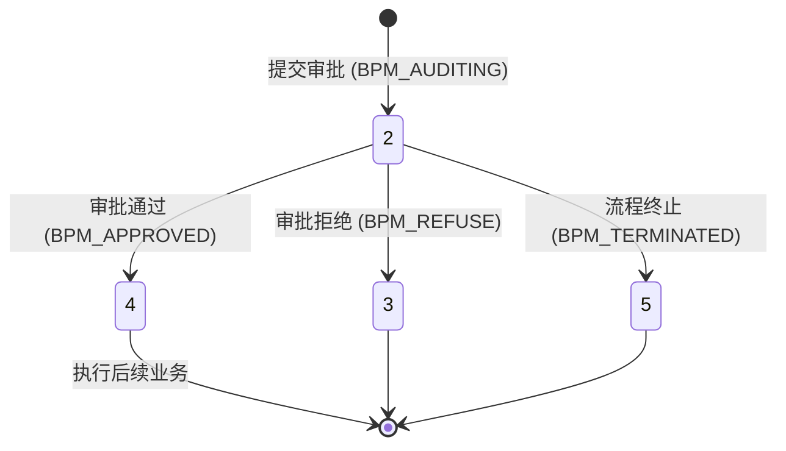

# BPM记录表

## 基础信息
| 属性 | 值 |
|------|-----|
| 数据库 | dataops |
| 表名 | dataops_bpm_record |
| 完整表名 | dataops.dataops_bpm_record |
| 数据源 | MySQL |

## 表结构

```sql
CREATE TABLE `dataops_bpm_record` (
  `id` bigint(20) NOT NULL AUTO_INCREMENT COMMENT 'BPM记录ID',
  `bpm_process_id` varchar(100) DEFAULT NULL COMMENT 'BPM流程实例ID',
  `process_key` varchar(100) DEFAULT NULL COMMENT '流程定义Key',
  `process_name` varchar(200) DEFAULT NULL COMMENT '流程名称',
  `order_no` varchar(100) DEFAULT NULL COMMENT '工单号（唯一标识）',
  `process_desc` varchar(500) DEFAULT NULL COMMENT '流程描述',
  `process_instance_node_id` bigint(20) DEFAULT NULL COMMENT '流程实例节点ID（关联任务ID）',
  `bpm_url` varchar(500) DEFAULT NULL COMMENT 'BPM工单URL',
  `bpm_title` varchar(500) DEFAULT NULL COMMENT 'BPM工单标题',
  `status` int(11) DEFAULT NULL COMMENT 'BPM状态：2(审批中)/3(审批拒绝)/4(审批通过)/5(终止)',
  `start_time` varchar(50) DEFAULT NULL COMMENT 'BPM开始时间',
  `end_time` varchar(50) DEFAULT NULL COMMENT 'BPM结束时间',
  `content` text COMMENT '审核反馈内容（JSON格式）',
  `created_by` varchar(100) DEFAULT NULL COMMENT '创建人姓名',
  `created_uid` varchar(100) DEFAULT NULL COMMENT '创建人UID',
  `updated_by` varchar(100) DEFAULT NULL COMMENT '更新人姓名',
  `state` int(11) DEFAULT '1' COMMENT '有效状态：1(有效)/0(无效)',
  `version` int(11) DEFAULT NULL COMMENT '版本号',
  `scene` varchar(100) DEFAULT NULL COMMENT '工单场景/类型',
  `created_at` timestamp NOT NULL DEFAULT CURRENT_TIMESTAMP COMMENT '创建时间',
  `updated_at` timestamp NOT NULL DEFAULT CURRENT_TIMESTAMP ON UPDATE CURRENT_TIMESTAMP COMMENT '更新时间',
  PRIMARY KEY (`id`),
  UNIQUE KEY `uk_order_no` (`order_no`),
  KEY `idx_bpm_process_id` (`bpm_process_id`),
  KEY `idx_process_instance_node_id` (`process_instance_node_id`),
  KEY `idx_status` (`status`),
  KEY `idx_scene` (`scene`),
  KEY `idx_created_at` (`created_at`)
) ENGINE=InnoDB DEFAULT CHARSET=utf8mb4 COMMENT='BPM工作流记录表';
```

## 字段说明

| 字段名 | 类型 | 必填 | 说明 | 测试值示例 |
|-------|------|-----|------|-----------|
| id | bigint(20) | 是 | 唯一标识 | 1001 |
| bpm_process_id | varchar(100) | 否 | BPM系统流程ID | "c153fac3-841f-4920..." |
| order_no | varchar(100) | 否 | 工单唯一编号 | "RCPLXZRW-20260225" |
| process_instance_node_id | bigint(20) | 否 | 关联业务任务ID | 378 |
| status | int(11) | 否 | 审批状态：2-审批中, 3-拒绝, 4-通过, 5-终止 | 4 |
| scene | varchar(100) | 否 | 业务场景标识 | "jdbcInputBatchAddTask" |
| content | text | 否 | 反馈详情(JSON) | {"rejectReason": "..."} |
| state | int(11) | 否 | 1-有效，0-无效 | 1 |
| created_at | timestamp | 是 | 创建时间 | "2026-02-25 10:00:00" |

## 关键字段

- **order_no**: **核心校验字段**。该字段具备唯一索引，是 DataOps 系统与外部 BPM 系统交互（特别是异步回调）时的唯一匹配凭证。
- **status**: 流程生命周期状态。只有当此字段流转至 `4 (审批通过)` 时，关联的业务任务才会被触发执行。
- **process_instance_node_id**: 业务关联键。用于定位该审批单对应的具体业务数据（如批量任务、入仓任务等）。
- **scene**: 业务路由键。定义了审批通过后，系统应调用哪一类 Handler 来处理后续逻辑。

## 业务规则

- **回调幂等性**: 处理 BPM 系统回调时，必须基于 `order_no` 进行状态校验，防止审批通过逻辑被重复执行。
- **状态单向流转**: 审批状态原则上只能从 `2 (审批中)` 流向终态（3、4、5），不可逆向回退。
- **工单号生成**: 工单号通常包含业务前缀与日期流水，确保系统内的全局唯一性。
- **逻辑关联**: 旧版 MySQL 入仓任务的 `scene` 字段可能为 NULL，代码逻辑需具备向下兼容性。

## 关联组件

- `[TKD_001]` 批量操作任务表: 通过 `process_instance_node_id` 关联。
- `[TKD_002]` 入仓任务主表: 涉及敏感字段变更或特定配置修改时，通过 `process_instance_node_id` 关联。


## 状态流转



## JSON字段结构

### content 字段说明
```json
{
  "rejectReason": "string",   // 审批拒绝原因说明
  "approverComments": "string" // 审批人备注
}
```

---
**质量检查**: 
- [x] 元数据包含 `database` 字段
- [x] 包含完整的 `CREATE TABLE` 语句
- [x] 字段说明表包含测试值示例
- [x] 已移除原内容中的 SQL 查询示例（禁止内容）
- [x] 无详细数据准备步骤
```