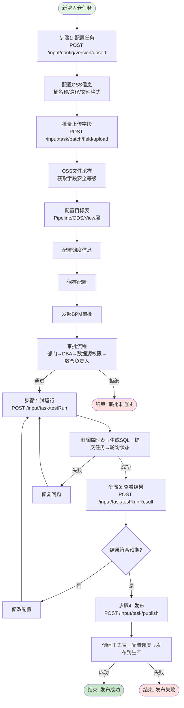

# JDBC入仓_业务流程文档

## 一、业务表结构

### 1.1 入仓任务管理层（新架构-有版本管理概念）

| 表名                                | 说明      | 关键字段                                                                       | 作用                                |
|-----------------------------------|---------|----------------------------------------------------------------------------|-----------------------------------|
| dataops_input_task                | 入仓任务主表  | id, version, created_by, updated_by                                        | 存储入仓任务基本信息，一个任务对应多个版本             |
| dataops_input_task_config_version | 任务版本配置表 | task_id, version, status, oss_path, bucket_name, ods_columns, view_columns | 存储每个版本的详细配置（OSS路径、字段、调度等）         |
| dataops_input_task_operation      | 任务操作记录表 | task_id, operation_name, status, version, flow_id                          | 记录试运行、发布等操作的执行状态和结果               |
| dataops_input_task_node_info      | 任务实例信息表 | task_id, node_id, pipeline_id, schedule_type, status                       | 存储任务在DP平台的实例信息（节点ID、Pipeline ID等） |

### 1.2 流程执行层（旧架构/底层-无版本管理）

| 表名                                           | 说明         | 关键字段                                                    | 作用                          |
|----------------------------------------------|------------|---------------------------------------------------------|-----------------------------|
| dataops_process_instance_info                | 流程实例表      | id, process_name, status, start_time, end_time          | 存储数据处理流程的实例信息，记录流程执行状态      |
| dataops_extract_node_config_info             | 抽数节点配置表    | id, node_id, datasource_id, extract_type, sql_content   | 配置数据抽取节点的详细信息（数据源、抽取方式、SQL） |
| dataops_extract_input_datasource_config_info | 抽数输入数据源配置表 | id, datasource_name, datasource_type, connection_info   | 配置输入数据源的连接信息（OSS、MySQL等）    |
| dataops_task_schedule_config_info            | 任务调度配置表    | id, task_id, schedule_type, cron_expression, start_time | 配置任务的调度策略（周期、cron表达式等）      |

### 1.3 元数据层

| 表名            | 说明   | 关键字段                                                  | 作用                            |
|---------------|------|-------------------------------------------------------|-------------------------------|
| dataops_table | 建表信息 | id, table_name, db_name, table_type, columns, comment | 数据表的元数据信息、建表 DDL、存储策略及生命周期配置。 |

### 1.4 批量操作层

| 表名                            | 说明       | 关键字段                                              | 作用                  |
|-------------------------------|----------|---------------------------------------------------|---------------------|
| dataops_batch_operation_task  | 批量操作作业表  | id, operation_type, task_ids, status, result_info | 支持批量发布、批量删除等批量操作任务  |

### 1.5 表关系说明

```
入仓任务管理层（新架构）
├── dataops_input_task (1)
│   └── dataops_input_task_config_version (1:N) - 一个任务多个版本
│       ├── dataops_input_task_operation (1:N) - 一个版本多次操作
│       └── dataops_input_task_node_info (1:1) - 一个版本对应一个DP实例
│
流程执行层（底层实现）
├── dataops_process_instance_info - 由operation触发创建
├── dataops_extract_node_config_info - 由node_info关联
├── dataops_task_schedule_config_info - 由config_version配置创建
└── dataops_extract_input_datasource_config_info - 由config_version的OSS配置创建

元数据层
└── dataops_table - 发布时创建/更新表元数据

批量操作层
└── dataops_batch_operation_task - 批量操作多个input_task
```
#### 这种设计属于典型的“中心辐射型”配置，dataops_extract_node_config_info（抽数节点配置表）是连接实例、调度、和数据源的最核心“枢纽”表。
```
SELECT 
    ins.id AS task_id,
    node.id AS node_id,
    ds.id AS datasource_id,
    sch.id AS schedule_id
FROM dataops_process_instance_info ins
JOIN dataops_extract_node_config_info node 
    ON ins.process_business_id = node.id
JOIN dataops_extract_input_datasource_config_info ds 
    ON node.extract_input_datasource_config_id = ds.id
JOIN dataops_task_schedule_config_info sch 
    ON node.extract_schedule_config_id = sch.id
WHERE ins.id = '你的作业ID';
```
## 二、核心接口

### 2.1 版本管理接口
- `POST /input/config/version/upsert` - **新建或更新版本（核心）**
- `POST /input/config/verify/config` - 桶名称+OSS路径唯一性校验
- `GET /input/config/version/list/{taskId}` - 获取版本列表
- `GET /input/config/version/detail/{taskId}/{versionId}` - 获取版本详情

### 2.2 任务操作接口
- `POST /input/task/publish` - 发布任务
- `POST /input/task/testRun` - 试运行
- `POST /input/task/testRunResult` - 获取试运行结果
- `POST /input/task/batch/field/upload` - **批量上传字段列表**
- `GET /input/task/download/field` - 下载字段模板
- `POST /input/task/oss/field/classify` - OSS文件采样获取字段安全等级
- `GET /input/task/delete` - 删除任务

### 2.3 查询接口
- `POST /input/task/page/list` - 分页查询任务列表
- `GET /input/task/{id}/detail` - 获取任务详情

### 2.4 运维接口
- `GET /input/ops/operation/list/{taskId}` - 获取操作记录列表
- `POST /input/ops/modify/operation` - 修改操作记录状态

## 三、完整业务流程

### 3.1 端到端流程图



### 3.2 核心流程说明

**新建版本流程（saveOrUpdateConfigVersion）**
1. taskId为空：创建InputTask主记录，version=1
2. version为空：创建新版本
   - 有baseVersion：复制基础版本，状态为草稿
   - 无baseVersion：创建全新版本，发起BPM审批
3. version不为空：更新现有版本配置

**试运行流程（testRun）**
1. 验证无运行中任务
2. 更新状态为"试运行中"，创建操作记录
3. 删除旧临时表（表名带ossTestRun后缀）
4. 生成SQL并提交到DP平台
5. 轮询任务状态，更新操作记录

**发布流程（publish）**
1. 验证无运行中任务
2. 更新状态为"发布中"，创建操作记录
3. 首次发布：创建Pipeline外表、ODS表、View表
4. 非首次发布：检查字段变更，执行ALTER TABLE
5. 配置调度任务，发布到生产环境

**批量上传字段流程（batchUploadField）**
1. 验证文件类型（仅支持csv/xlsx）
2. 解析文件内容，提取字段信息
3. 返回解析结果（包含失败行详情）
4. 前端使用解析结果填充到版本配置

## 四、关键业务规则

### 4.1 版本管理
- 每个任务支持多版本，首次创建version=1
- 新增版本时自动递增版本号
- 可基于已有版本复制创建新版本

### 4.2 BPM审批
- 仅创建全新版本时发起BPM流程（非baseVersion复制）
- 审批流程：部门审核 → DBA审核 → 数据源权限审核 → 数仓负责人审核
- 审批通过后才能试运行和发布

### 4.3 字段安全等级
- 所有字段必须配置安全等级
- View层仅展示非敏感字段
- 支持OSS文件采样自动获取字段安全等级

### 4.4 试运行发布
- 试运行前删除旧临时表，临时表名带"ossTestRun"后缀
- 试运行成功后才能发布
- 发布前验证无运行中任务
- 首次发布创建正式表，非首次发布检查字段变更

## 五、注意事项


1. **并发控制**：发布和试运行前验证无运行中任务
2. **幂等性**：建表语句幂等，表存在时不重复创建
3. **异步执行**：试运行和发布使用@Async异步执行
4. **错误处理**：所有操作记录到operation表，包含成功/失败状态
5. **批量上传**：支持XLSX格式，解析失败返回详细失败行信息
6. **唯一性校验**：桶名称+OSS路径需唯一性校验
7. **Job调度**：无专门入仓Job，发布后由DP平台按调度配置自动执行

