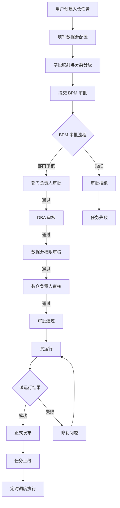
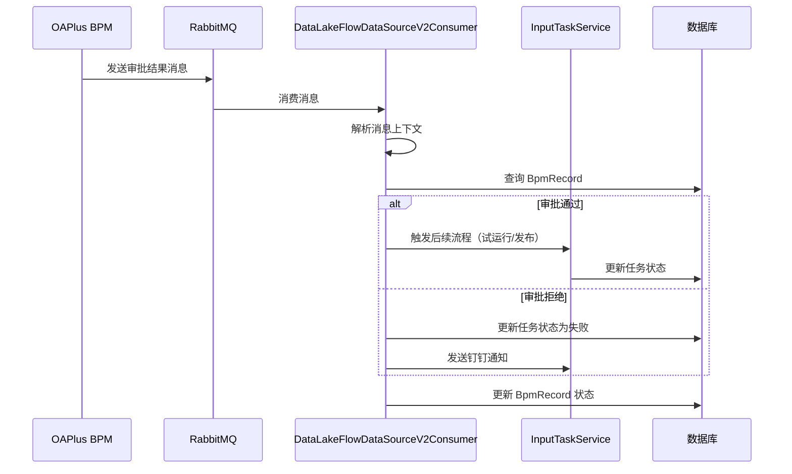
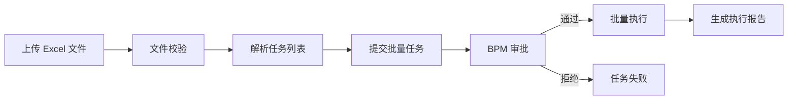
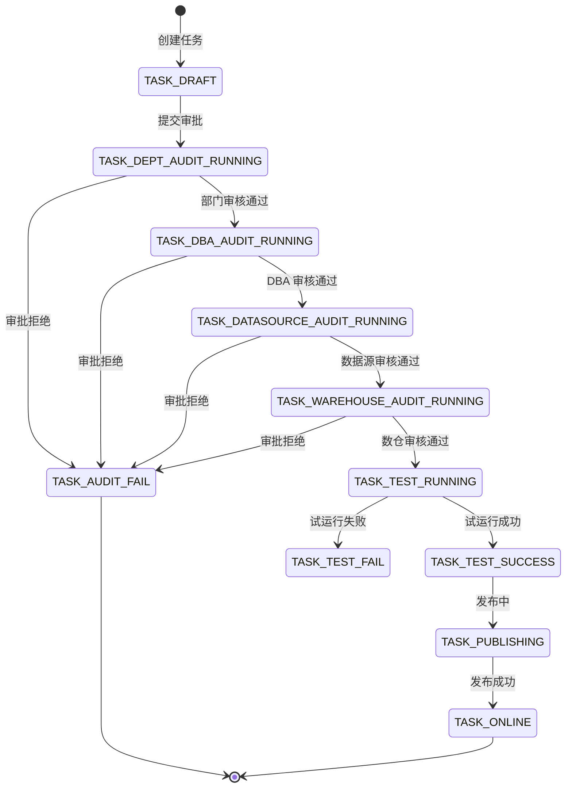

# JDBC 入仓工作流梳理文档

> 文档版本：v1.0
> 生成时间：2026-02-05
> 适用对象：测试人员

---

## 一、工作流概览

JDBC 入仓是指从外部 MySQL 数据库将数据导入到数据仓库（DataSparrow）的完整流程。整个流程涉及任务创建、BPM 审批、试运行、正式发布等多个环节。

### 1.1 核心流程图



---

## 二、涉及的接口清单

### 2.1 入仓任务管理接口

**控制器**: `cn.caijiajia.dataops.controller.input.InputTaskController`

| 接口路径 | 方法 | 功能描述 | 关键参数 |
|---------|------|---------|---------|
| `/input/task/page/list` | POST | 分页查询任务列表 | InputTaskPageConditionDto |
| `/input/task/{id}/detail` | GET | 获取任务详情 | taskId |
| `/input/task/statusList` | GET | 获取任务状态列表 | - |
| `/input/task/publish` | POST | 发布任务 | InputPublishReq |
| `/input/task/testRun` | POST | 试运行 | InputPublishReq |
| `/input/task/testRunResult` | POST | 获取试运行结果 | TaskVersionReq |
| `/input/task/oss/filePath/verify` | POST | 校验 OSS 路径 | VerifyPathReq |
| `/input/task/oss/field/classify` | POST | 异步获取字段安全等级 | UpdateInputTaskReq |
| `/input/task/oss/field/classify/result` | POST | 获取字段分类分级结果 | UpdateInputTaskReq |
| `/input/task/ossPath/list` | GET | 查询 OSS 桶路径列表 | ossPath |
| `/input/task/odsLoan/table/list` | GET | 查询 ODS 层表名列表 | odsLoanTableName |
| `/input/task/view/table/list` | GET | 查询 VIEW 层表名列表 | viewTableName |
| `/input/task/getMultiAgent` | GET | 根据桶名称获取多主体信息 | bucketName |

### 2.2 批量操作接口

**控制器**: `cn.caijiajia.dataops.controller.etlx.EtlxBatchTaskController`

| 接口路径 | 方法 | 功能描述 | 关键参数 |
|---------|------|---------|---------|
| `/etlx/batch/upload` | POST | 上传批量操作文件 | MultipartFile, taskType |
| `/etlx/batch/submit` | POST | 提交批量操作任务 | BatchOperationSubmitReq |
| `/etlx/batch/page` | POST | 分页查询批量任务 | BatchTaskPageReq |
| `/etlx/batch/{id}/detail` | GET | 获取批量任务详情 | taskId |
| `/etlx/batch/{id}/result` | GET | 获取批量任务执行结果 | taskId |

### 2.3 外部系统对接接口

**控制器**: `cn.caijiajia.dataops.controller.external.ExternalTaskController`

| 接口路径 | 方法 | 功能描述 | 关键参数 |
|---------|------|---------|---------|
| `/external/task/submit` | POST | 外部系统提交任务 | ExternalTaskSubmitReq |
| `/external/task/{taskId}/status` | GET | 查询任务状态 | taskId |
| `/external/task/{taskId}/result` | GET | 查询任务执行结果 | taskId |

---

## 三、外部服务调用

### 3.1 DataSparrow（数据仓库平台）

**服务类**: `cn.caijiajia.dataops.service.soa.DataSparrowService`

**主要功能**:
- 创建数据仓库表（`createTable`）
- 修改表结构（`alterTable`）
- 删除表（`dropTable`）
- 创建数据处理任务（`createDataProcess`）
- 发布任务到生产环境（`publishTask`）
- 手动触发任务执行（`runManualTask`）
- 查询任务执行状态（`getTaskStatus`）

**关键接口**:
```java
// 创建表
CreateTableReq createTableReq = new CreateTableReq();
dataSparrowService.createTable(createTableReq);

// 创建数据处理任务
DpDataProcessReq processReq = new DpDataProcessReq();
DpDataProcessResp resp = dataSparrowService.createDataProcess(processReq);

// 发布任务
dataSparrowService.publishTask(taskId, DpPublishTaskType.PUBLISH);
```

### 3.2 OneMeta（元数据管理）

**服务类**: `cn.caijiajia.dataops.service.soa.OneMetaService`

**主要功能**:
- 查询表元数据信息
- 获取字段分类分级信息
- 同步元数据变更

### 3.3 OAPlus（BPM 工作流系统）

**服务类**: `cn.caijiajia.dataops.service.flow.OaplusAwsbpmService`

**主要功能**:
- 启动 BPM 审批流程（`startProcess`）
- 查询流程状态（`getProcessStatus`）
- 终止流程（`terminateProcess`）

**流程 Key**: `data_lake_datasource`

### 3.4 PolicyManagement（数据治理）

**服务类**: `cn.caijiajia.dataops.service.soa.PolicyManagementService`

**主要功能**:
- 字段安全等级校验
- 敏感字段审批

---

## 四、BPM 工作流详解

### 4.1 JDBC 入仓 BPM 流程

**流程实现类**: `cn.caijiajia.dataops.v2.bpm.impl.JdbcInputBpmProcess`

**流程 Key**: `data_lake_datasource`

**场景标识**: `dataLakeInputJDBC`

### 4.2 审批节点

| 节点顺序 | 节点名称 | 审批人 | 处理器类 | 说明 |
|---------|---------|--------|---------|------|
| 1 | 部门审核 | 部门负责人 | `DeptAuditHandler` | 审核业务合理性 |
| 2 | DBA 审核 | DBA | `DbaAuditHandler` | 审核数据库权限和安全性 |
| 3 | 数据源权限审核 | 数据源管理员 | `DataSourcePermissionAuditHandler` | ���核数据源访问权限 |
| 4 | 数仓负责人审核 | 数仓负责人 | `DataWarehouseOwnerAuditHandler` | 最终审核 |

### 4.3 BPM 消息消费

**消费者类**: `cn.caijiajia.dataops.consumer.DataLakeFlowDataSourceV2Consumer`

**监听队列**: RabbitMQ 队列（具体队列名在配置文件中）

**消息格式**:
```json
{
  "orderNo": "BPM工单号",
  "status": "审批状态码",
  "scene": "dataLakeInputJDBC",
  "activityName": "当前审批节点名称",
  "dataMap": {
    "rejectReason": "拒绝原因（如果被拒绝）"
  }
}
```

**状态码映射**:
- `BPM_APPROVED` (1): 审批通过
- `BPM_REFUSE` (2): 审批拒绝
- `BPM_TERMINATED` (3): 流程终止

### 4.4 BPM 回调处理流程



---

## 五、批量操作工作流

### 5.1 批量操作流程

**场景**: JDBC 入仓批量操作界面化

**流程实现类**: `cn.caijiajia.dataops.v2.bpm.impl.BatchOperationBpmProcess`

**审批处理器**: `cn.caijiajia.dataops.v2.bpm.handler.batch.BatchOperationApprovalHandler`

### 5.2 批量操作步骤



### 5.3 批量操作 BPM 消费

**消费者类**: `cn.caijiajia.dataops.consumer.BatchOperationFlowConsumer`

**场景标识**:
- `batchInputJdbcOperation` - JDBC 入仓批量操作
- `batchInputOssOperation` - OSS 入仓批量操作

**处理逻辑**:
1. 审批通过：调用 `BatchOperationExecutorService.executeFromOss()` 执行批量操作
2. 审批拒绝：更新任务状态为 `APPROVING_FAIL`

---

## 六、关键数据流转

### 6.1 任务状态流转



### 6.2 核心实体

| 实体类 | 表名 | 说明 |
|-------|------|------|
| `InputTask` | `input_task` | 入仓任务主表 |
| `InputTaskConfigVersion` | `input_task_config_version` | 任务配置版本表 |
| `InputTaskNodeInfo` | `input_task_node_info` | 任务节点信息表 |
| `BpmRecord` | `bpm_record` | BPM 流程记录表 |
| `DataOpsBatchOperationTask` | `dataops_batch_operation_task` | 批量操作任务表 |

---

## 七、测试要点

### 7.1 功能测试

#### 7.1.1 任务创建
- [ ] 创建 JDBC 入仓任务
- [ ] 填写数据源配置（实例名、数据库名、表名）
- [ ] 配置字段映射
- [ ] 字段分类分级（敏感字段识别）
- [ ] 保存草稿

#### 7.1.2 BPM 审批流程
- [ ] 提交审批
- [ ] 部门审核通过/拒绝
- [ ] DBA 审核通过/拒绝
- [ ] 数据源权限审核通过/拒绝
- [ ] 数仓负责人审核通过/拒绝
- [ ] 审批拒绝后任务状态正确
- [ ] 审批通过后自动进入试运行

#### 7.1.3 试运行
- [ ] 触发试运行
- [ ] 查看试运行日志
- [ ] 试运行成功
- [ ] 试运行失败处理

#### 7.1.4 正式发布
- [ ] 发布到生产环境
- [ ] 任务上线
- [ ] 定时调度执行
- [ ] 查看执行日志

#### 7.1.5 批量操作
- [ ] 上传批量操作 Excel 文件
- [ ] 文件格式校验
- [ ] 提交批量任务
- [ ] 批量任务 BPM 审批
- [ ] 批量执行
- [ ] 查看执行报告

### 7.2 接口测试

#### 7.2.1 正常流程测试
```bash
# 1. 创建任务
POST /input/task/create
{
  "instanceName": "test-mysql",
  "dbName": "test_db",
  "tableName": "user_info",
  "projectName": "test_project"
}

# 2. 提交审批
POST /input/task/publish
{
  "taskId": 123,
  "version": 1
}

# 3. 查询任务详情
GET /input/task/123/detail

# 4. 试运行
POST /input/task/testRun
{
  "taskId": 123,
  "version": 1
}

# 5. 查询试运行结果
POST /input/task/testRunResult
{
  "taskId": 123,
  "version": 1
}
```

#### 7.2.2 异常场景测试
- [ ] 参数校验（必填项、格式校验）
- [ ] 权限校验
- [ ] 数据源连接失败
- [ ] 表不存在
- [ ] 字段映射错误
- [ ] 并发操作冲���

### 7.3 BPM 消息测试

#### 7.3.1 消息格式测试
- [ ] 正常消息格式
- [ ] 缺少必填字段
- [ ] 字段类型错误
- [ ] 消息重复消费（幂等性）

#### 7.3.2 审批状态测试
- [ ] 审批通过消息
- [ ] 审批拒绝消息
- [ ] 流程终止消息
- [ ] 中间节点审批消息

### 7.4 性能测试

- [ ] 批量操作性能（1000+ 条记录）
- [ ] 并发创建任务
- [ ] 大表字段映射（500+ 字段）
- [ ] 试运行大数据量（百万级）

### 7.5 集成测试

- [ ] DataSparrow 集成（创建表、任务）
- [ ] OneMeta 集成（元数据同步）
- [ ] OAPlus BPM 集成（审批流程）
- [ ] RabbitMQ 消息消费
- [ ] Redis 缓存

---

## 八、常见问题排查

### 8.1 BPM 审批不回调

**排查步骤**:
1. 检查 RabbitMQ 队列是否有消息堆积
2. 查看 `DataLakeFlowDataSourceV2Consumer` 日志
3. 检查 `bpm_record` 表中的记录状态
4. 验证 BPM 流程配置是否正确

### 8.2 试运行失败

**排查步骤**:
1. 查看 DataSparrow 任务执行日志
2. 检查数据源连接配置
3. 验证字段映射是否正确
4. 检查目标表是否存在

### 8.3 发布失败

**排查步骤**:
1. 查看发布日志
2. 检查 DataSparrow 发布接口返回
3. 验证任务配置完整性
4. 检查调度配置

---

## 九、相关文档

- [JDBC 入仓批量操作需求分析](./docs/JDBC入仓批量操作需求分析.md)
- [SFTP 外部系统对接技术方案](./docs/SFTP外部系统对接技术方案.md)
- [DataSparrow API 文档](内部链接)
- [OAPlus BPM 开发指南](内部链接)

---

## 十、附录

### 10.1 关键代码位置

| 功能模块 | 代码路径 |
|---------|---------|
| 入仓控制器 | `dataops/src/main/java/cn/caijiajia/dataops/controller/input/InputTaskController.java` |
| 入仓服务 | `dataops/src/main/java/cn/caijiajia/dataops/service/input/InputTaskService.java` |
| BPM 流程实现 | `dataops/src/main/java/cn/caijiajia/dataops/v2/bpm/impl/JdbcInputBpmProcess.java` |
| BPM 消息消费 | `dataops/src/main/java/cn/caijiajia/dataops/consumer/DataLakeFlowDataSourceV2Consumer.java` |
| 批量操作控制器 | `dataops/src/main/java/cn/caijiajia/dataops/controller/etlx/EtlxBatchTaskController.java` |
| 批量操作审批处理 | `dataops/src/main/java/cn/caijiajia/dataops/v2/bpm/handler/batch/BatchOperationApprovalHandler.java` |
| DataSparrow 集成 | `dataops/src/main/java/cn/caijiajia/dataops/service/soa/DataSparrowService.java` |

### 10.2 配置文件

- `application.properties` - 主配置文件
- `application-local.properties` - 本地开发配置
- `applicationContext.xml` - Spring 上下文配置

---

**文档维护**: DataOps 测试团队
**最后更新**: 2026-02-05
